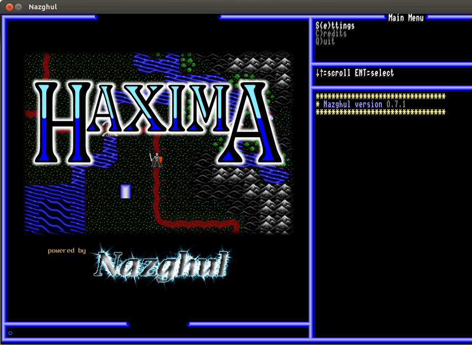

Nazghul Game Makers Guide
=========================

This guide is for people who want to make their own ultima-like games but don't
want to write their own engine. It uses the nazghul engine, a project I started
years ago expressly for this purpose.

But first let me discourage you. The nazghul engine is not easy to work
with. Your game will be mostly written in scheme, an unpopular language with
few advocates. The engine itself is a horrid mixture of C and C++. The
interface between the engine and the script is somewhat ad-hoc. It has a
functional but unfriendly terrain editor. In summary, most of your work will be
in a text editor. And it will be a lot of work. Making a game like haxima takes
an enormous amount of time.

But there is some hope. First of all, nazghul is very stable with very few
known bugs. Second, scheme is pretty easy to learn in and of itself and you may
be in the small percentage of the population that loves it. Thirdly, you have
this manual to guide you. And, finally, for some people, making a game is more
rewarding than any other human endeavor, and the challenges are worth facing.

# Downloading And Installing

## 1. The Minimal Setup

This chapter will help you setup the absolute bare minimum to get the nazghul
engine to even start. The engine needs some initialization files to specify the
character images, splash images and frame elements. It expects to find a scheme
file called kern-init.scm to specify these things. You don't have to lay out
your game like this, but you *must* have kern-init.scm in the launch directory
and it *must* specify all the elements listed in the example below.

Make a directory with some image files like this:

    .
    ├── images
    │   └── engine
    │       ├── 640x480_splash.png
    │       ├── charset.png
    │       ├── cursor.png
    │       ├── frame.png
    │       ├── progress_bar_image.png
    │       └── splash.png
    └── kern-init.scm

You can figure out the format of the image files by studying the ones that come
with Haxima. kern-init.scm is a scheme file and it should have the following
settings to match this directory layout:

    (kern-cfg-set 
    
     ;; This is the image file for the UI border. The pieces need to be arranged in
     ;; a specific order in this image.
     "frame-image-filename"  "images/engine/frame.png"
    
     ;; These are the letters used by the console, etc, in the UI. The character
     ;; sprites need to be arranged in a specific order in this image.
     "ascii-image-filename"  "images/engine/charset.png"
    
     ;; This is the cursor prompt used by the command window in the UI. It should
     ;; have four animation frames.
     "cursor-image-filename" "images/engine/cursor.png"
    
     ;; This is the script file run when the user selects the "Start New Game"
     ;; option from the main menu.
     "new-game-filename"     "start-new-game.scm"
    
     ;; This is the script file run when the user selects the "Journey Onward"
     ;; option from the main menu. It lists the current save files.
     "save-game-filename"     "saved-games.scm"
    
     ;; This is the script file run when the user selects the "Tutorial"
     ;; option from the main menu.
     "tutorial-filename"     "tutorial.scm"
    
     ;; This is the script file which runs the demo scene on startup.
     "demo-filename" "demo.scm"
    
     ;; These are the filenames of the splash image shown on startup for the
     ;; various supported screen sizes. The format of the key must be
     ;; <width>x<height>-splash-image-filename.
     "1280x960-splash-image-filename" "images/engine/splash.png"
     "640x480-splash-image-filename" "images/engine/640x480_splash.png"
     "800x480-splash-image-filename" "images/engine/640x480_splash.png"
    
    ;; This is the image for the sprite pieces of the progress bar.
    "progress-bar-image-filename" "images/engine/progress_bar_image.png"
    
     )
    
Now cd to that directory and start nazghul:

    nazghul

You should see:

## 2. Hello World

In this chapter you will create your first world. I'll show you the minimal
amount of code and other stuff you need to get a guy on the screen walking
around, and I'll talk about some of the principles behind what is going on.
