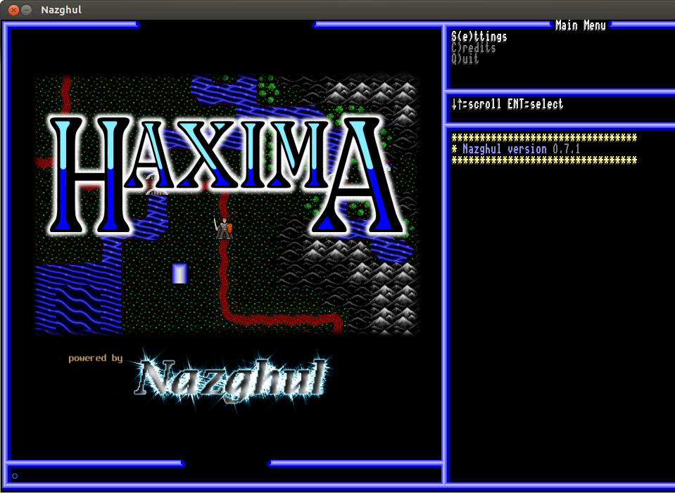

# 1. The Minimal Setup

This chapter will help you setup the absolute bare minimum to get the nazghul
engine to even start. The engine needs some initialization files to specify the
character images, splash images and frame elements. It expects to find a scheme
file called kern-init.scm to specify these things. You don't have to lay out
your game like this, but you *must* have kern-init.scm in the launch directory
and it *must* specify all the elements listed in the example below.

You will need to make a new directory to hold your game. I recommend you put it
wherever you installed nazghul in the first chapter, directly alongside the
existing haxima-1.002 directory. For example, if you call it MyGame:

    nazghul
    `-worlds
      |- haxima-1.002
      |- MyGame
      ...etc...

Now copy some files from haxima-1.002 to fill out MyGame, laying them out like this:

    MyGame
    |- images
    |  `-engine
    |    |- 640x480_splash.png
    |    |- charset.png
    |    |- cursor.png
    |    |- frame.png
    |    |- progress_bar_image.png
    |    `- splash.png
    `- kern-init.scm

You can figure out the format of the image files by studying the ones that come
with Haxima. Now edit kern-init.scm. This is a scheme file and it should have
the following settings to match this directory layout:

    (kern-cfg-set 
    
     ;; This is the image file for the UI border. The pieces need to be arranged in
     ;; a specific order in this image.
     "frame-image-filename"  "images/engine/frame.png"
    
     ;; These are the letters used by the console, etc, in the UI. The character
     ;; sprites need to be arranged in a specific order in this image.
     "ascii-image-filename"  "images/engine/charset.png"
    
     ;; This is the cursor prompt used by the command window in the UI. It should
     ;; have four animation frames.
     "cursor-image-filename" "images/engine/cursor.png"
    
     ;; This is the script file run when the user selects the "Start New Game"
     ;; option from the main menu.
     "new-game-filename"     "start-new-game.scm"
    
     ;; This is the script file run when the user selects the "Journey Onward"
     ;; option from the main menu. It lists the current save files.
     "save-game-filename"     "saved-games.scm"
    
     ;; This is the script file run when the user selects the "Tutorial"
     ;; option from the main menu.
     "tutorial-filename"     "tutorial.scm"
    
     ;; This is the script file which runs the demo scene on startup.
     "demo-filename" "demo.scm"
    
     ;; These are the filenames of the splash image shown on startup for the
     ;; various supported screen sizes. The format of the key must be
     ;; <width>x<height>-splash-image-filename.
     "1280x960-splash-image-filename" "images/engine/splash.png"
     "640x480-splash-image-filename" "images/engine/640x480_splash.png"
     "800x480-splash-image-filename" "images/engine/640x480_splash.png"
    
    ;; This is the image for the sprite pieces of the progress bar.
    "progress-bar-image-filename" "images/engine/progress_bar_image.png"
    
     )

The file consists of a single scheme procedure invocation. It is calling
kern-cfg-set with a sequence of name/value pairs, all of which are strings. In
scheme, procedures all called like this:

    (PROCEDURE argument1 argument2 <etc>).

The parentheses are not optional. They mean "evaluate what is between us and
return the result". Whenever you see them in examples, enter them exactly the
same way, without any extras. Any procedure which calls into the engine starts
with a "kern-" prefix (for kernel). This procedure, kern-cfg-set, gives the
engine these name/value pairs as parameters for it to use while starting up.

When the game starts the engine will be running the default haxima game. You
will of course want it to run your game instead. The approach here varies
depending on your OS.

## Windows

Under Windows there are two ways to make the engine switch. The first is to
modify the startup command:

1. Under the start menu, right click on Haxima, then select Properties.
2. Select the Shortcut tab
3. Edit the Target field, changing the -I option from haxima-1.002 to the
   directory where your new game is. Note that the directory path is relative
   to the nazghul.exe program file.

The other method is to run it directly from a command prompt:

1. From the start menu select Command Prompt
2. Change directories to your game folder and start the nazghul program, for
   example:

   cd C:\Program Files (x86)\Haxima\MyGame
   nazghul

You should see the screenshot shown below under Result.

## OS

Now cd to that directory and start nazghul:

    nazghul

## Result

You should see:

